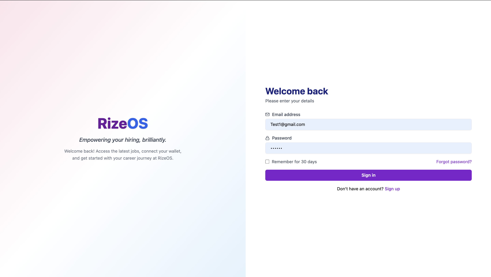
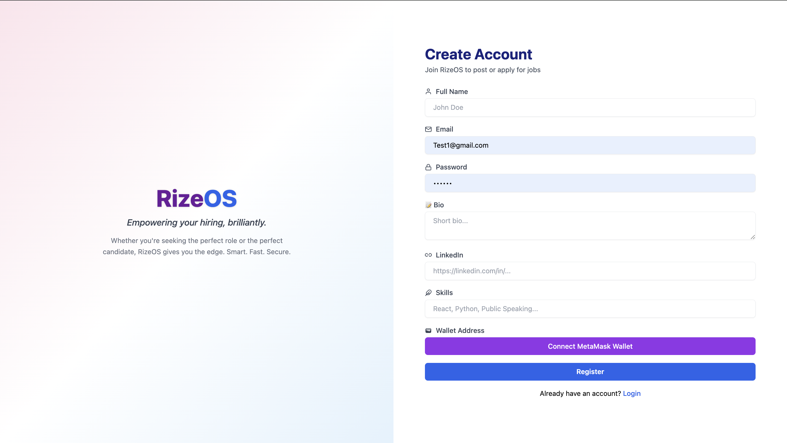
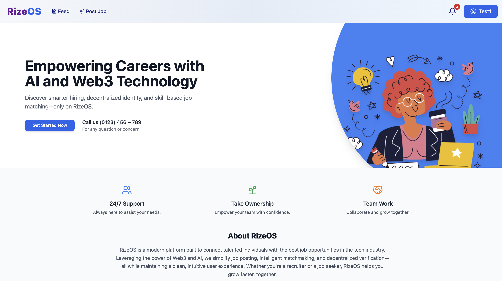
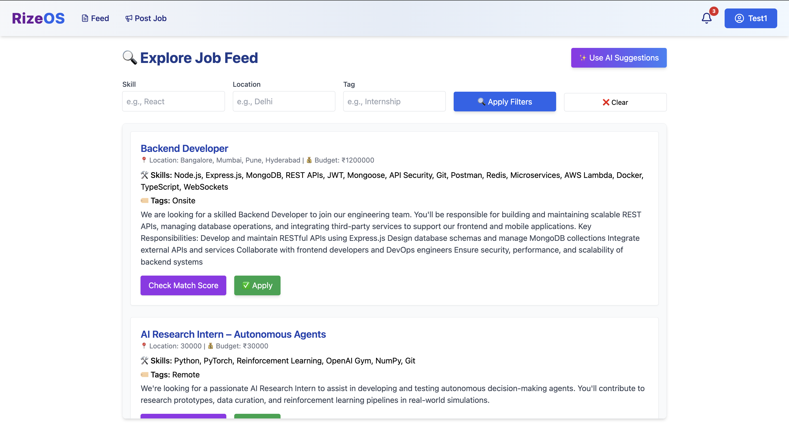
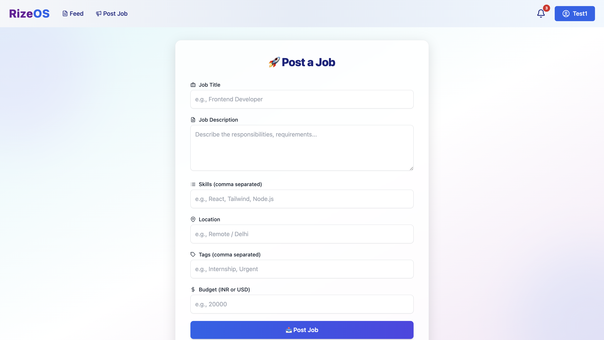
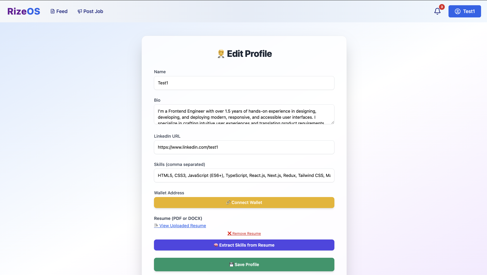
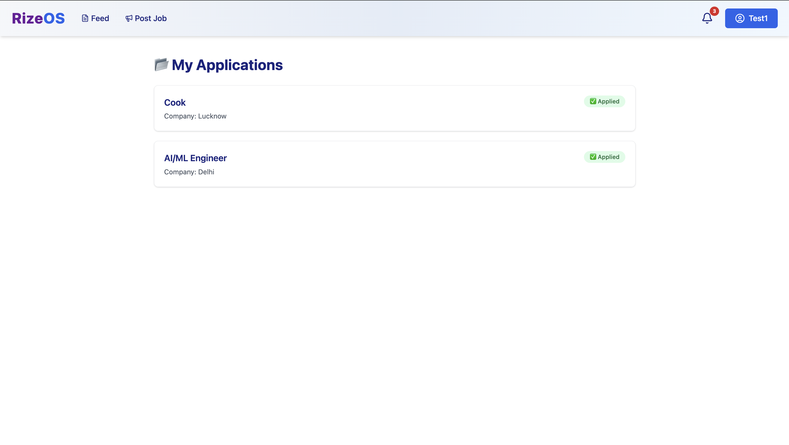
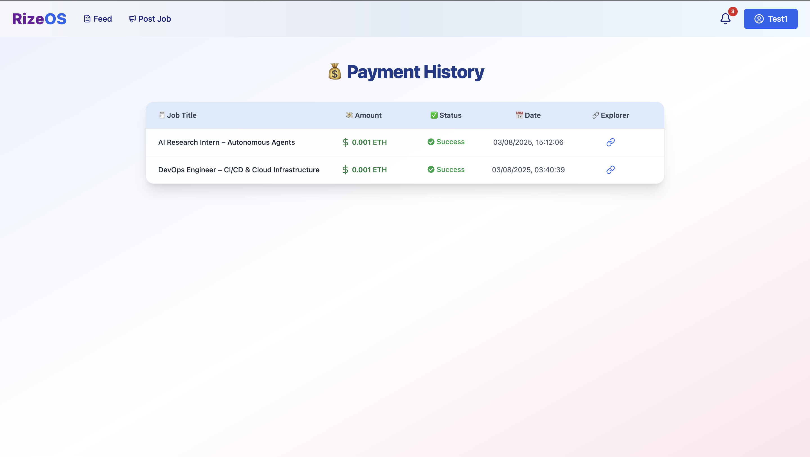
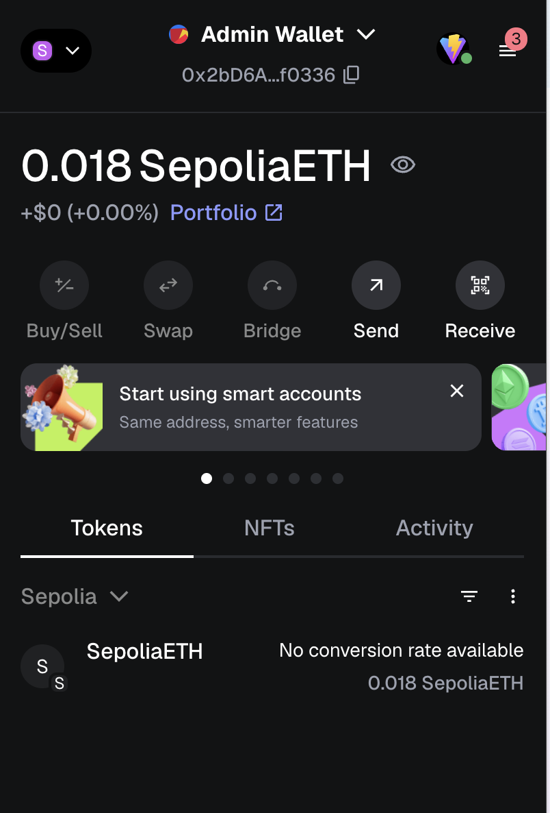

# 🚀 RizeOS – AI + Web3 Job Platform

**RizeOS** is an intelligent, decentralized job and talent discovery platform powered by AI & Web3. It features semantic job matching, MetaMask wallet integration, and end-to-end recruitment tools – all in a clean developer-friendly stack.

---

## ⚙️ Tech Stack Overview

### 🖥️ Frontend
| Tech | Description |
|------|-------------|
|  | Component-based UI |
|  | Fast bundler |
|  | Utility-first CSS |
|  | SPA Routing |
|  | Feedback system |
|  | Icon packs |

### 🌐 Backend
| Tech | Description |
|------|-------------|
|  | Backend runtime |
|  | API framework |
|  | Database |
|  | Mongo wrapper |
|  | Secure tokens |
|  | Hosted backend |

### 🤖 AI + ML Microservice
| Tech | Description |
|------|-------------|
|  | Flask service |
|  | Semantic embeddings |
|  | Fuzzy string logic |
|  | Vector comparison |
|  | AI service hosting |

### 🧾 Web3 + Payments
| Tech | Description |
|------|-------------|
|  | Wallet login |
|  | ETH transactions |
|  | Smart payments |
|  | Payment logs |

---

## 🧠 Core Features

### 🔐 Authentication & Profile
- JWT-based email login
- MetaMask address stored securely
- Profile includes bio, skills, LinkedIn, resume upload
- Role-agnostic (can post & apply both)

### 🏠 Homepage
- Clean gradient hero section
- Animated icons / SVGs
- 24/7 support highlight + ownership intent

### 📝 Job Posting
- Post with title, description, budget, skills, tags
- ETH payment (0.001) required to post job
- Payment logged on-chain

### 🧠 AI-Powered Job Feed
- Match Score based on:
  - Semantic bio ↔ job description
  - Skill vector overlap
  - Fuzzy & token matching
- Dynamic color badges for match strength

### 📄 Applications
- Apply to jobs via "Apply" button
- Auto-shows "Applied" if already applied
- `/applications` page shows user submissions

### 💳 Payments
- ETH sent to admin wallet on posting
- Payment logged (job, txn hash, etherscan link)
- `/payments` shows all transaction history

---

## 📸 Screenshots

| Login | Register | Home |
|-------|----------|------|
|  |  |  |

| Feed (AI + Normal) | Job Post | Edit Profile |
|--------------------|----------|---------------|
|  |  |  |

| Applications | Payment History | Admin Wallet |
|--------------|------------------|---------------|
|  |  |  |

---

## 🧩 Folder Structure

```bash
RizeOS/
├── frontend/
│   ├── src/
│   │   ├── pages/           # Login, Register, JobFeed, JobPost, EditProfile etc.
│   │   ├── components/      # Navbar, Modals, ScoreBadge etc.
│   │   ├── utils/           # payPlatformFee.js, wallet.js, PrivateRoute.jsx
│   │   ├── App.jsx
│   │   └── index.css
├── backend/
│   ├── models/              # User, Job, Application, Payment
│   ├── controllers/         # authController.js, jobController.js
│   ├── routes/              # /auth, /jobs, /ai, /payments, /applications
│   ├── middlewares/         # authMiddleware.js
│   └── server.js
├── ml/                      # match_score.py, ml_api.py
│   └── Dockerfile
├── .env
└── README.md
```
🧪 Match Score Logic (AI Breakdown)
Component	Method
🔬 Bio ↔ Description	Semantic similarity
🧠 Skills ↔ Job Skills	Cosine + Fuzzy + Token scoring
⚖️ Weightage	

    20% bio-desc semantic similarity

    20% skill embedding similarity

    40% fuzzy skill score

    10% token score

🟢 Outputs:

    Match Score (0-100)

    Label: 🔥 Strong, ⚠️ Moderate, ❌ Weak

🧑‍💻 Author

    Name: Tejash Tarun

    Role: Full Stack Developer | AI + Web3 Engineer | UI/UX Lead

    GitHub: @tejash05

🌐 Deployment Info
| Service       | Link                                                                 |
|---------------|----------------------------------------------------------------------|
| 🖥️ Frontend   | [https://rizeos-3dca.onrender.com](https://rizeos-3dca.onrender.com) |


# 1. Clone repo
```
git clone https://github.com/tejash05/RizeOS.git
cd RizeOS
```

# 2. Start backend
```
cd backend
npm install
npm run dev
```

# 3. Start frontend
```
cd ../frontend
npm install
npm run dev
```

# 4. Start ML API
```
cd ../ml
pip install -r requirements.txt
python ml_api.py
```

🧪 Ensure .env is configured for backend (Mongo URI, JWT secret, etc.)

    Star ⭐ the repo if this helped you! Contributions & forks welcome 🧑‍💻
